## 一、管理员认证流程

### 1.1 管理员登录时序图

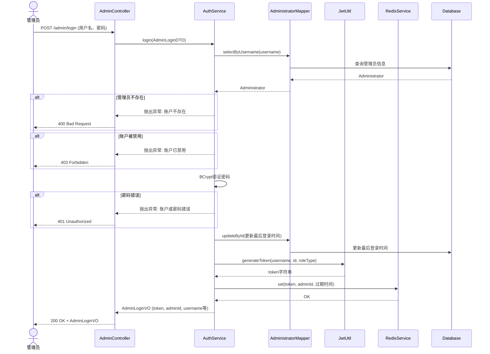
```mermaid
sequenceDiagram
    actor 管理员
    participant Controller as AdminController
    participant Service as AuthService
    participant Mapper as AdministratorMapper
    participant JWT as JwtUtil
    participant Redis as RedisService
    participant DB as Database
    
    管理员->>Controller: POST /admin/login (用户名、密码)
    Controller->>Service: login(AdminLoginDTO)
    
    Service->>Mapper: selectByUsername(username)
    Mapper->>DB: 查询管理员信息
    DB-->>Mapper: Administrator
    Mapper-->>Service: Administrator
    
    alt 管理员不存在
        Service-->>Controller: 抛出异常: 账户不存在
        Controller-->>管理员: 400 Bad Request
    end
    
    alt 账户被禁用
        Service-->>Controller: 抛出异常: 账户已禁用
        Controller-->>管理员: 403 Forbidden
    end
    
    Service->>Service: BCrypt验证密码
    alt 密码错误
        Service-->>Controller: 抛出异常: 账户或密码错误
        Controller-->>管理员: 401 Unauthorized
    end
    
    Service->>Mapper: updateById(更新最后登录时间)
    Mapper->>DB: 更新最后登录时间
    
    Service->>JWT: generateToken(username, id, roleType)
    JWT-->>Service: token字符串
    
    Service->>Redis: set(token, adminId, 过期时间)
    Redis-->>Service: OK
    
    Service-->>Controller: AdminLoginVO (token, adminId, username等)
    Controller-->>管理员: 200 OK + AdminLoginVO
```

**说明**：
- 使用BCrypt算法验证密码
- 生成JWT Token并存储在Redis中，有效期为配置的过期时间
- Token同时包含用户信息和角色权限

### 1.2 管理员登出时序图

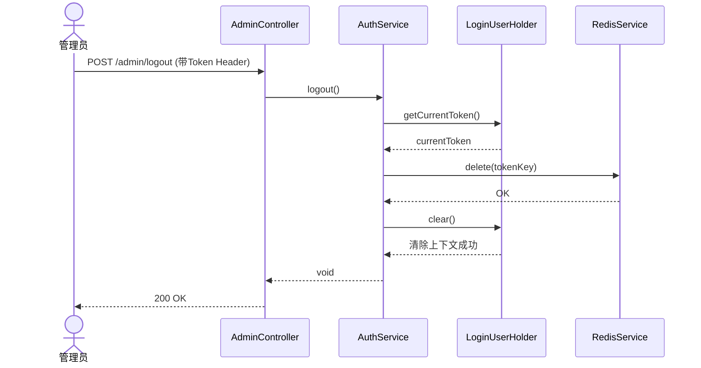
```mermaid
sequenceDiagram
    actor 管理员
    participant Controller as AdminController
    participant Service as AuthService
    participant Holder as LoginUserHolder
    participant Redis as RedisService
    
    管理员->>Controller: POST /admin/logout (带Token Header)
    Controller->>Service: logout()
    
    Service->>Holder: getCurrentToken()
    Holder-->>Service: currentToken
    
    Service->>Redis: delete(tokenKey)
    Redis-->>Service: OK
    
    Service->>Holder: clear()
    Holder-->>Service: 清除上下文成功
    
    Service-->>Controller: void
    Controller-->>管理员: 200 OK
```

---

## 二、活动管理流程

### 2.1 活动创建时序图

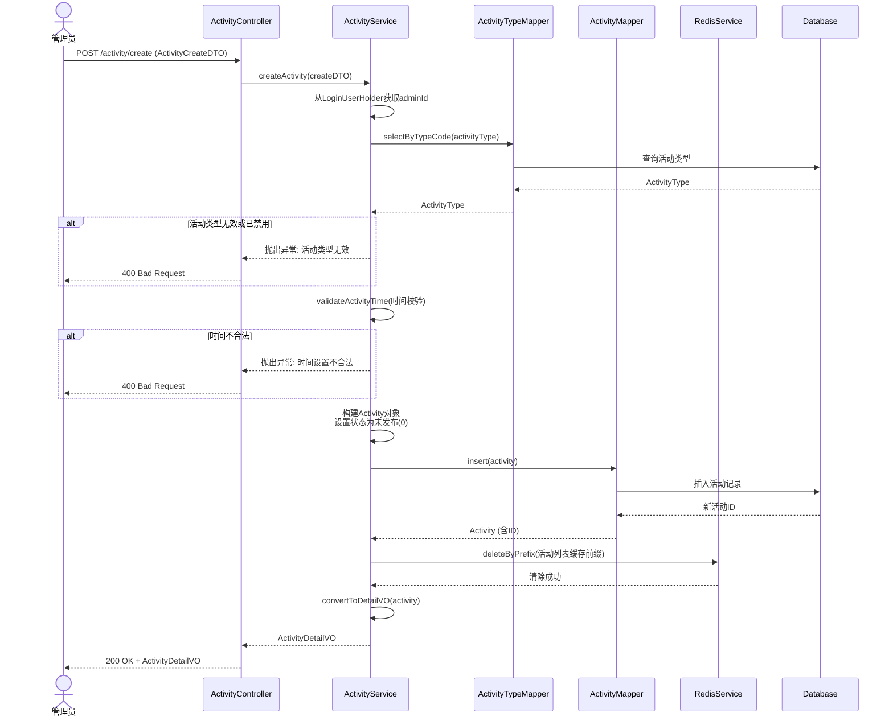
```mermaid
sequenceDiagram
    actor 管理员
    participant Controller as ActivityController
    participant Service as ActivityService
    participant TypeMapper as ActivityTypeMapper
    participant Mapper as ActivityMapper
    participant Redis as RedisService
    participant DB as Database
    
    管理员->>Controller: POST /activity/create (ActivityCreateDTO)
    Controller->>Service: createActivity(createDTO)
    
    Service->>Service: 从LoginUserHolder获取adminId
    
    Service->>TypeMapper: selectByTypeCode(activityType)
    TypeMapper->>DB: 查询活动类型
    DB-->>TypeMapper: ActivityType
    TypeMapper-->>Service: ActivityType
    
    alt 活动类型无效或已禁用
        Service-->>Controller: 抛出异常: 活动类型无效
        Controller-->>管理员: 400 Bad Request
    end
    
    Service->>Service: validateActivityTime(时间校验)
    alt 时间不合法
        Service-->>Controller: 抛出异常: 时间设置不合法
        Controller-->>管理员: 400 Bad Request
    end
    
    Service->>Service: 构建Activity对象<br/>设置状态为未发布(0)
    Service->>Mapper: insert(activity)
    Mapper->>DB: 插入活动记录
    DB-->>Mapper: 新活动ID
    Mapper-->>Service: Activity (含ID)
    
    Service->>Redis: deleteByPrefix(活动列表缓存前缀)
    Redis-->>Service: 清除成功
    
    Service->>Service: convertToDetailVO(activity)
    Service-->>Controller: ActivityDetailVO
    Controller-->>管理员: 200 OK + ActivityDetailVO
```

**说明**：
- 活动创建后默认状态为"未发布"(0)
- 时间校验包括：活动结束时间>开始时间，报名截止时间<活动开始时间
- 创建后清除活动列表缓存

### 2.2 活动发布流程图

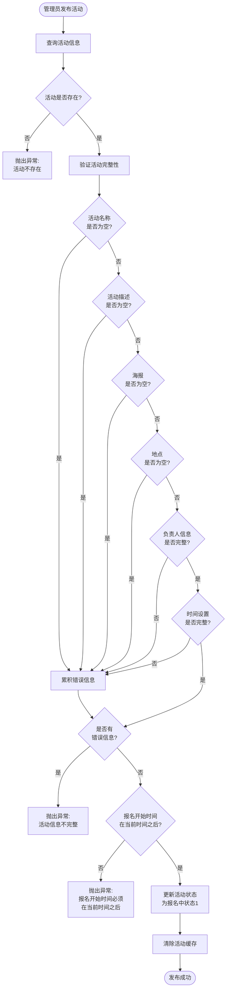
```mermaid
flowchart TD
    Start([管理员发布活动]) --> GetActivity[查询活动信息]
    GetActivity --> CheckExists{活动是否存在?}
    CheckExists -->|否| Error1[抛出异常:<br/>活动不存在]
    CheckExists -->|是| ValidateCompleteness[验证活动完整性]
    
    ValidateCompleteness --> CheckName{活动名称<br/>是否为空?}
    CheckName -->|是| BuildError[累积错误信息]
    CheckName -->|否| CheckDesc{活动描述<br/>是否为空?}
    
    CheckDesc -->|是| BuildError
    CheckDesc -->|否| CheckPoster{海报<br/>是否为空?}
    
    CheckPoster -->|是| BuildError
    CheckPoster -->|否| CheckLocation{地点<br/>是否为空?}
    
    CheckLocation -->|是| BuildError
    CheckLocation -->|否| CheckContact{负责人信息<br/>是否完整?}
    
    CheckContact -->|否| BuildError
    CheckContact -->|是| CheckTime{时间设置<br/>是否完整?}
    
    CheckTime -->|否| BuildError
    BuildError --> HasError{是否有<br/>错误信息?}
    CheckTime -->|是| HasError
    
    HasError -->|是| Error2[抛出异常:<br/>活动信息不完整]
    HasError -->|否| CheckRegTime{报名开始时间<br/>在当前时间之后?}
    
    CheckRegTime -->|否| Error3[抛出异常:<br/>报名开始时间必须<br/>在当前时间之后]
    CheckRegTime -->|是| UpdateStatus[更新活动状态<br/>为报名中状态1]
    
    UpdateStatus --> ClearCache[清除活动缓存]
    ClearCache --> End([发布成功])
```

**说明**：
- 发布前进行严格的完整性检查
- 发布后活动状态变更为"报名中"(1)
- 报名开始时间必须晚于当前时间

### 2.3 活动状态转换图

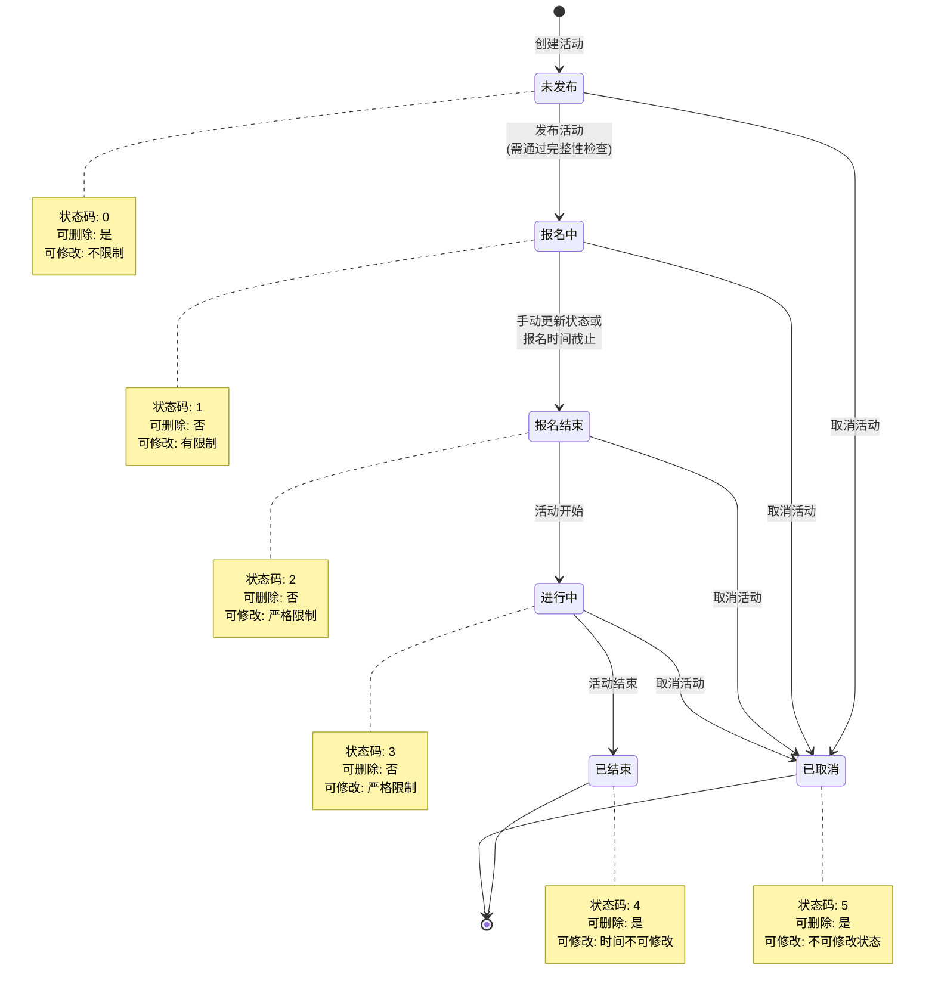
```mermaid
stateDiagram-v2
    [*] --> 未发布: 创建活动
    
    未发布 --> 报名中: 发布活动<br/>(需通过完整性检查)
    未发布 --> 已取消: 取消活动
    
    报名中 --> 报名结束: 手动更新状态或<br/>报名时间截止
    报名中 --> 已取消: 取消活动
    
    报名结束 --> 进行中: 活动开始
    报名结束 --> 已取消: 取消活动
    
    进行中 --> 已结束: 活动结束
    进行中 --> 已取消: 取消活动
    
    已结束 --> [*]
    已取消 --> [*]
    
    note right of 未发布
        状态码: 0
        可删除: 是
        可修改: 不限制
    end note
    
    note right of 报名中
        状态码: 1
        可删除: 否
        可修改: 有限制
    end note
    
    note right of 报名结束
        状态码: 2
        可删除: 否
        可修改: 严格限制
    end note
    
    note right of 进行中
        状态码: 3
        可删除: 否
        可修改: 严格限制
    end note
    
    note right of 已结束
        状态码: 4
        可删除: 是
        可修改: 时间不可修改
    end note
    
    note right of 已取消
        状态码: 5
        可删除: 是
        可修改: 不可修改状态
    end note
```

### 2.4 活动删除流程图

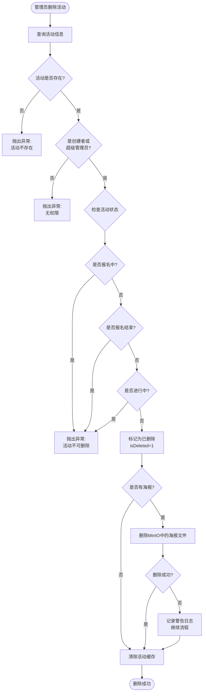
```mermaid
flowchart TD
    Start([管理员删除活动]) --> GetActivity[查询活动信息]
    GetActivity --> CheckExists{活动是否存在?}
    CheckExists -->|否| Error1[抛出异常:<br/>活动不存在]
    CheckExists -->|是| CheckPermission{是创建者或<br/>超级管理员?}
    
    CheckPermission -->|否| Error2[抛出异常:<br/>无权限]
    CheckPermission -->|是| CheckStatus{检查活动状态}
    
    CheckStatus --> IsRegistering{是否报名中?}
    IsRegistering -->|是| Error3[抛出异常:<br/>活动不可删除]
    IsRegistering -->|否| IsRegEnded{是否报名结束?}
    
    IsRegEnded -->|是| Error3
    IsRegEnded -->|否| IsInProgress{是否进行中?}
    
    IsInProgress -->|是| Error3
    IsInProgress -->|否| MarkDeleted[标记为已删除<br/>isDeleted=1]
    
    MarkDeleted --> CheckPoster{是否有海报?}
    CheckPoster -->|是| DeletePoster[删除MinIO中的海报文件]
    CheckPoster -->|否| ClearCache
    
    DeletePoster --> PosterSuccess{删除成功?}
    PosterSuccess -->|否| LogWarning[记录警告日志<br/>继续流程]
    PosterSuccess -->|是| ClearCache
    LogWarning --> ClearCache
    
    ClearCache[清除活动缓存] --> End([删除成功])
```

**说明**：
- 只有未发布、已结束、已取消的活动可以删除
- 删除活动时同步删除MinIO中的海报文件
- 海报删除失败不影响活动删除，只记录警告

---

## 三、学生报名流程

### 3.1 报名流程时序图

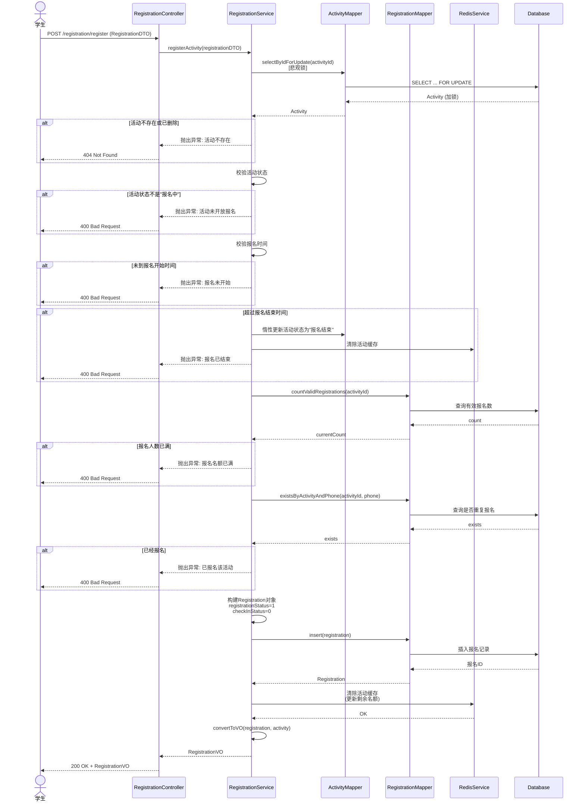
```mermaid
sequenceDiagram
    actor 学生
    participant Controller as RegistrationController
    participant Service as RegistrationService
    participant ActivityMapper
    participant RegistrationMapper
    participant Redis as RedisService
    participant DB as Database
    
    学生->>Controller: POST /registration/register (RegistrationDTO)
    Controller->>Service: registerActivity(registrationDTO)
    
    Service->>ActivityMapper: selectByIdForUpdate(activityId)<br/>[悲观锁]
    ActivityMapper->>DB: SELECT ... FOR UPDATE
    DB-->>ActivityMapper: Activity (加锁)
    ActivityMapper-->>Service: Activity
    
    alt 活动不存在或已删除
        Service-->>Controller: 抛出异常: 活动不存在
        Controller-->>学生: 404 Not Found
    end
    
    Service->>Service: 校验活动状态
    alt 活动状态不是"报名中"
        Service-->>Controller: 抛出异常: 活动未开放报名
        Controller-->>学生: 400 Bad Request
    end
    
    Service->>Service: 校验报名时间
    alt 未到报名开始时间
        Service-->>Controller: 抛出异常: 报名未开始
        Controller-->>学生: 400 Bad Request
    end
    
    alt 超过报名结束时间
        Service->>ActivityMapper: 惰性更新活动状态为"报名结束"
        Service->>Redis: 清除活动缓存
        Service-->>Controller: 抛出异常: 报名已结束
        Controller-->>学生: 400 Bad Request
    end
    
    Service->>RegistrationMapper: countValidRegistrations(activityId)
    RegistrationMapper->>DB: 查询有效报名数
    DB-->>RegistrationMapper: count
    RegistrationMapper-->>Service: currentCount
    
    alt 报名人数已满
        Service-->>Controller: 抛出异常: 报名名额已满
        Controller-->>学生: 400 Bad Request
    end
    
    Service->>RegistrationMapper: existsByActivityAndPhone(activityId, phone)
    RegistrationMapper->>DB: 查询是否重复报名
    DB-->>RegistrationMapper: exists
    RegistrationMapper-->>Service: exists
    
    alt 已经报名
        Service-->>Controller: 抛出异常: 已报名该活动
        Controller-->>学生: 400 Bad Request
    end
    
    Service->>Service: 构建Registration对象<br/>registrationStatus=1<br/>checkInStatus=0
    Service->>RegistrationMapper: insert(registration)
    RegistrationMapper->>DB: 插入报名记录
    DB-->>RegistrationMapper: 报名ID
    RegistrationMapper-->>Service: Registration
    
    Service->>Redis: 清除活动缓存<br/>(更新剩余名额)
    Redis-->>Service: OK
    
    Service->>Service: convertToVO(registration, activity)
    Service-->>Controller: RegistrationVO
    Controller-->>学生: 200 OK + RegistrationVO
```

**说明**：
- 使用悲观锁(`FOR UPDATE`)防止超卖
- 报名成功后清除活动缓存，更新剩余名额信息
- 数据库有唯一索引(activity_id, student_phone)防止重复报名

### 3.2 报名业务流程活动图

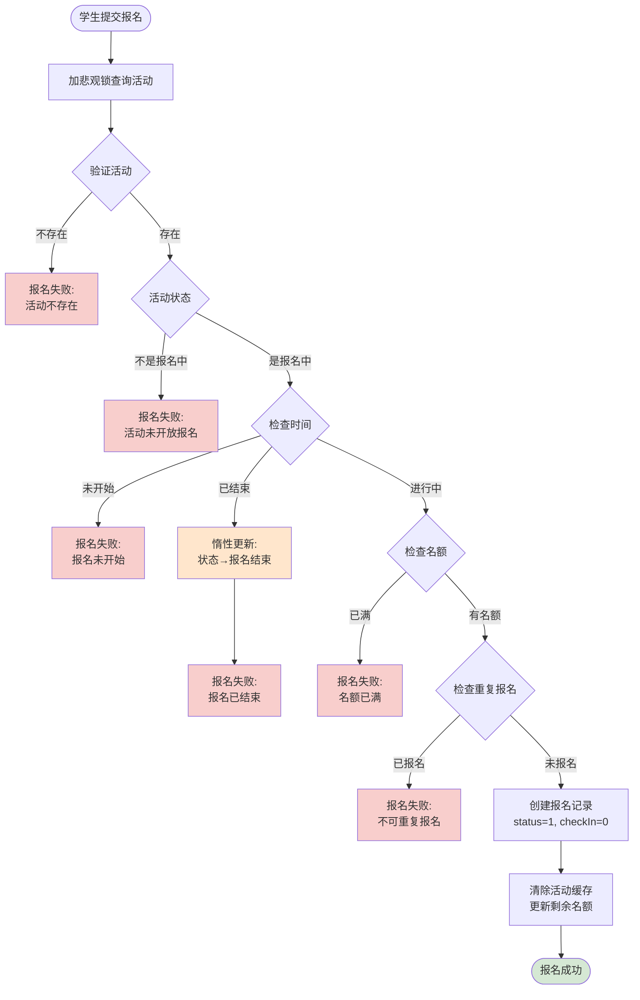
```mermaid
flowchart TD
    Start([学生提交报名]) --> LockActivity[加悲观锁查询活动]
    LockActivity --> ValidateActivity{验证活动}
    
    ValidateActivity -->|不存在| Fail1[报名失败:<br/>活动不存在]
    ValidateActivity -->|存在| CheckStatus{活动状态}
    
    CheckStatus -->|不是报名中| Fail2[报名失败:<br/>活动未开放报名]
    CheckStatus -->|是报名中| CheckTime{检查时间}
    
    CheckTime -->|未开始| Fail3[报名失败:<br/>报名未开始]
    CheckTime -->|已结束| LazyUpdate[惰性更新:<br/>状态→报名结束]
    LazyUpdate --> Fail4[报名失败:<br/>报名已结束]
    CheckTime -->|进行中| CheckQuota{检查名额}
    
    CheckQuota -->|已满| Fail5[报名失败:<br/>名额已满]
    CheckQuota -->|有名额| CheckDuplicate{检查重复报名}
    
    CheckDuplicate -->|已报名| Fail6[报名失败:<br/>不可重复报名]
    CheckDuplicate -->|未报名| CreateRecord[创建报名记录<br/>status=1, checkIn=0]
    
    CreateRecord --> UpdateCache[清除活动缓存<br/>更新剩余名额]
    UpdateCache --> Success([报名成功])
    
    style LazyUpdate fill:#ffe6cc
    style Success fill:#d5e8d4
    style Fail1 fill:#f8cecc
    style Fail2 fill:#f8cecc
    style Fail3 fill:#f8cecc
    style Fail4 fill:#f8cecc
    style Fail5 fill:#f8cecc
    style Fail6 fill:#f8cecc
```

### 3.3 报名状态转换图

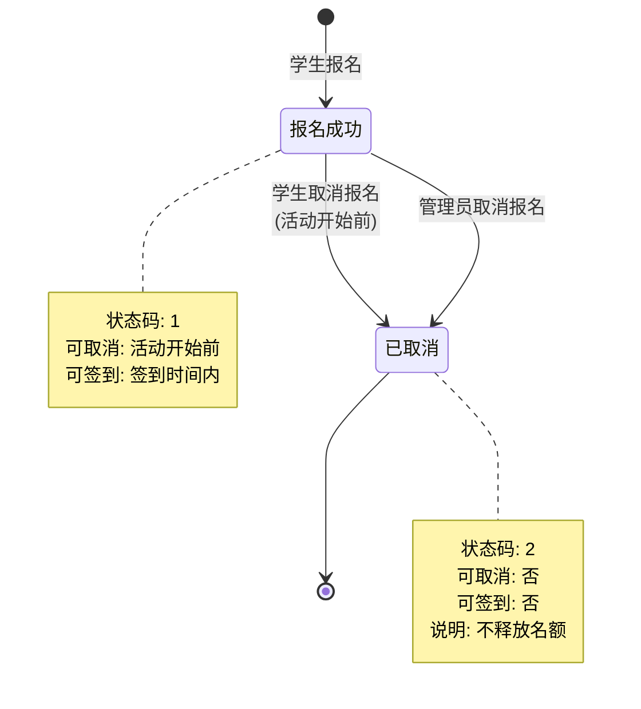
```mermaid
stateDiagram-v2
    [*] --> 报名成功: 学生报名
    
    报名成功 --> 已取消: 学生取消报名<br/>(活动开始前)
    报名成功 --> 已取消: 管理员取消报名
    
    已取消 --> [*]
    
    note right of 报名成功
        状态码: 1
        可取消: 活动开始前
        可签到: 签到时间内
    end note
    
    note right of 已取消
        状态码: 2
        可取消: 否
        可签到: 否
        说明: 不释放名额
    end note
```

---

## 四、签到流程

### 4.1 二维码签到时序图

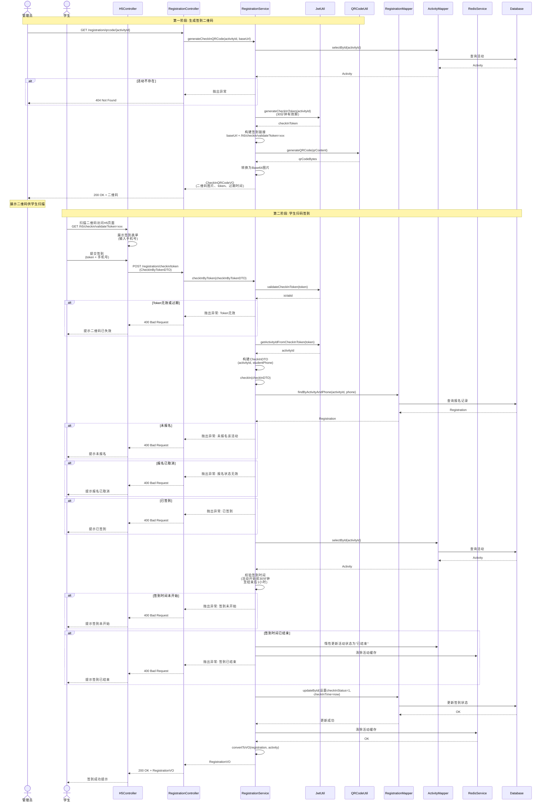
```mermaid
sequenceDiagram
    actor 管理员
    actor 学生
    participant H5 as H5Controller
    participant RegController as RegistrationController
    participant Service as RegistrationService
    participant JWT as JwtUtil
    participant QRUtil as QRCodeUtil
    participant Mapper as RegistrationMapper
    participant ActMapper as ActivityMapper
    participant Redis as RedisService
    participant DB as Database
    
    Note over 管理员,QRUtil: 第一阶段: 生成签到二维码
    
    管理员->>RegController: GET /registration/qrcode/{activityId}
    RegController->>Service: generateCheckInQRCode(activityId, baseUrl)
    
    Service->>ActMapper: selectById(activityId)
    ActMapper->>DB: 查询活动
    DB-->>ActMapper: Activity
    ActMapper-->>Service: Activity
    
    alt 活动不存在
        Service-->>RegController: 抛出异常
        RegController-->>管理员: 404 Not Found
    end
    
    Service->>JWT: generateCheckInToken(activityId)<br/>(30分钟有效期)
    JWT-->>Service: checkInToken
    
    Service->>Service: 构建签到链接<br/>baseUrl + /h5/checkin/validate?token=xxx
    Service->>QRUtil: generateQRCode(qrContent)
    QRUtil-->>Service: qrCodeBytes
    
    Service->>Service: 转换为Base64图片
    Service-->>RegController: CheckInQRCodeVO<br/>(二维码图片、token、过期时间)
    RegController-->>管理员: 200 OK + 二维码
    
    Note over 管理员: 展示二维码供学生扫描
    
    Note over 学生,DB: 第二阶段: 学生扫码签到
    
    学生->>H5: 扫描二维码访问H5页面<br/>GET /h5/checkin/validate?token=xxx
    H5->>H5: 展示签到表单<br/>(输入手机号)
    学生->>H5: 提交签到<br/>(token + 手机号)
    
    H5->>RegController: POST /registration/checkin/token<br/>(CheckInByTokenDTO)
    RegController->>Service: checkInByToken(checkInByTokenDTO)
    
    Service->>JWT: validateCheckInToken(token)
    JWT-->>Service: isValid
    
    alt Token无效或过期
        Service-->>RegController: 抛出异常: Token无效
        RegController-->>H5: 400 Bad Request
        H5-->>学生: 提示二维码已失效
    end
    
    Service->>JWT: getActivityIdFromCheckInToken(token)
    JWT-->>Service: activityId
    
    Service->>Service: 构建CheckInDTO<br/>(activityId, studentPhone)
    Service->>Service: checkIn(checkInDTO)
    
    Service->>Mapper: findByActivityAndPhone(activityId, phone)
    Mapper->>DB: 查询报名记录
    DB-->>Mapper: Registration
    Mapper-->>Service: Registration
    
    alt 未报名
        Service-->>RegController: 抛出异常: 未报名该活动
        RegController-->>H5: 400 Bad Request
        H5-->>学生: 提示未报名
    end
    
    alt 报名已取消
        Service-->>RegController: 抛出异常: 报名状态无效
        RegController-->>H5: 400 Bad Request
        H5-->>学生: 提示报名已取消
    end
    
    alt 已签到
        Service-->>RegController: 抛出异常: 已签到
        RegController-->>H5: 400 Bad Request
        H5-->>学生: 提示已签到
    end
    
    Service->>ActMapper: selectById(activityId)
    ActMapper->>DB: 查询活动
    DB-->>ActMapper: Activity
    ActMapper-->>Service: Activity
    
    Service->>Service: 校验签到时间<br/>(活动开始前30分钟<br/>至结束后1小时)
    
    alt 签到时间未开始
        Service-->>RegController: 抛出异常: 签到未开始
        RegController-->>H5: 400 Bad Request
        H5-->>学生: 提示签到未开始
    end
    
    alt 签到时间已结束
        Service->>ActMapper: 惰性更新活动状态为"已结束"
        Service->>Redis: 清除活动缓存
        Service-->>RegController: 抛出异常: 签到已结束
        RegController-->>H5: 400 Bad Request
        H5-->>学生: 提示签到已结束
    end
    
    Service->>Mapper: updateById(设置checkInStatus=1,<br/>checkInTime=now)
    Mapper->>DB: 更新签到状态
    DB-->>Mapper: OK
    Mapper-->>Service: 更新成功
    
    Service->>Redis: 清除活动缓存
    Redis-->>Service: OK
    
    Service->>Service: convertToVO(registration, activity)
    Service-->>RegController: RegistrationVO
    RegController-->>H5: 200 OK + RegistrationVO
    H5-->>学生: 签到成功提示
```

**说明**：
- 签到二维码30分钟有效期
- 签到时间窗口：活动开始前30分钟至结束后1小时
- 支持惰性更新：签到时检测活动状态并自动更新

### 4.2 签到验证流程图

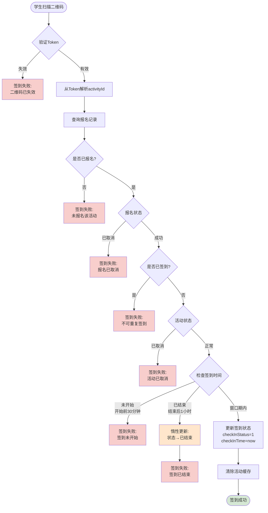
```mermaid
flowchart TD
    Start([学生扫描二维码]) --> ValidateToken{验证Token}
    ValidateToken -->|失效| Fail1[签到失败:<br/>二维码已失效]
    ValidateToken -->|有效| GetActivityId[从Token解析activityId]
    
    GetActivityId --> FindReg[查询报名记录]
    FindReg --> CheckReg{是否已报名?}
    
    CheckReg -->|否| Fail2[签到失败:<br/>未报名该活动]
    CheckReg -->|是| CheckRegStatus{报名状态}
    
    CheckRegStatus -->|已取消| Fail3[签到失败:<br/>报名已取消]
    CheckRegStatus -->|成功| CheckAlready{是否已签到?}
    
    CheckAlready -->|是| Fail4[签到失败:<br/>不可重复签到]
    CheckAlready -->|否| CheckActStatus{活动状态}
    
    CheckActStatus -->|已取消| Fail5[签到失败:<br/>活动已取消]
    CheckActStatus -->|正常| CheckTime{检查签到时间}
    
    CheckTime -->|未开始<br/>开始前30分钟| Fail6[签到失败:<br/>签到未开始]
    CheckTime -->|已结束<br/>结束后1小时| LazyUpdate[惰性更新:<br/>状态→已结束]
    LazyUpdate --> Fail7[签到失败:<br/>签到已结束]
    
    CheckTime -->|窗口期内| UpdateCheckIn[更新签到状态<br/>checkInStatus=1<br/>checkInTime=now]
    
    UpdateCheckIn --> ClearCache[清除活动缓存]
    ClearCache --> Success([签到成功])
    
    style LazyUpdate fill:#ffe6cc
    style Success fill:#d5e8d4
    style Fail1 fill:#f8cecc
    style Fail2 fill:#f8cecc
    style Fail3 fill:#f8cecc
    style Fail4 fill:#f8cecc
    style Fail5 fill:#f8cecc
    style Fail6 fill:#f8cecc
    style Fail7 fill:#f8cecc
```

---

## 五、文件上传流程

### 5.1 MinIO文件上传时序图

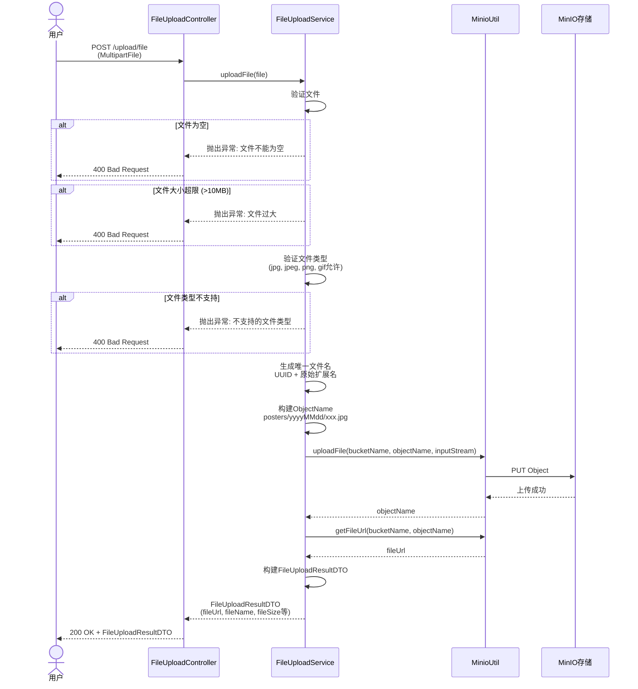
```mermaid
sequenceDiagram
    actor 用户
    participant Controller as FileUploadController
    participant Service as FileUploadService
    participant MinIO as MinioUtil
    participant Storage as MinIO存储
    
    用户->>Controller: POST /upload/file<br/>(MultipartFile)
    Controller->>Service: uploadFile(file)
    
    Service->>Service: 验证文件
    alt 文件为空
        Service-->>Controller: 抛出异常: 文件不能为空
        Controller-->>用户: 400 Bad Request
    end
    
    alt 文件大小超限 (>10MB)
        Service-->>Controller: 抛出异常: 文件过大
        Controller-->>用户: 400 Bad Request
    end
    
    Service->>Service: 验证文件类型<br/>(jpg, jpeg, png, gif允许)
    alt 文件类型不支持
        Service-->>Controller: 抛出异常: 不支持的文件类型
        Controller-->>用户: 400 Bad Request
    end
    
    Service->>Service: 生成唯一文件名<br/>UUID + 原始扩展名
    Service->>Service: 构建ObjectName<br/>posters/yyyyMMdd/xxx.jpg
    
    Service->>MinIO: uploadFile(bucketName, objectName, inputStream)
    MinIO->>Storage: PUT Object
    Storage-->>MinIO: 上传成功
    MinIO-->>Service: objectName
    
    Service->>MinIO: getFileUrl(bucketName, objectName)
    MinIO-->>Service: fileUrl
    
    Service->>Service: 构建FileUploadResultDTO
    Service-->>Controller: FileUploadResultDTO<br/>(fileUrl, fileName, fileSize等)
    Controller-->>用户: 200 OK + FileUploadResultDTO
```

**说明**：
- 支持的图片格式：jpg, jpeg, png, gif
- 文件大小限制：10MB
- 文件名使用UUID保证唯一性
- 按日期分目录存储：posters/yyyyMMdd/

### 5.2 文件删除流程图

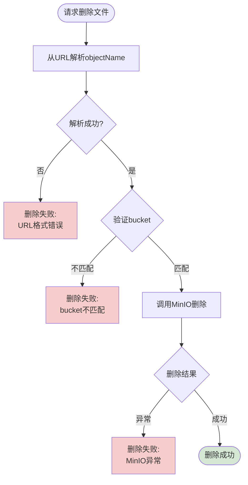
```mermaid
flowchart TD
    Start([请求删除文件]) --> ParseUrl[从URL解析objectName]
    ParseUrl --> CheckParse{解析成功?}
    
    CheckParse -->|否| Fail1[删除失败:<br/>URL格式错误]
    CheckParse -->|是| CheckBucket{验证bucket}
    
    CheckBucket -->|不匹配| Fail2[删除失败:<br/>bucket不匹配]
    CheckBucket -->|匹配| CallMinIO[调用MinIO删除]
    
    CallMinIO --> CheckResult{删除结果}
    CheckResult -->|异常| Fail3[删除失败:<br/>MinIO异常]
    CheckResult -->|成功| Success([删除成功])
    
    style Success fill:#d5e8d4
    style Fail1 fill:#f8cecc
    style Fail2 fill:#f8cecc
    style Fail3 fill:#f8cecc
```

---

## 六、AI海报生成流程

### 6.1 AI海报生成时序图

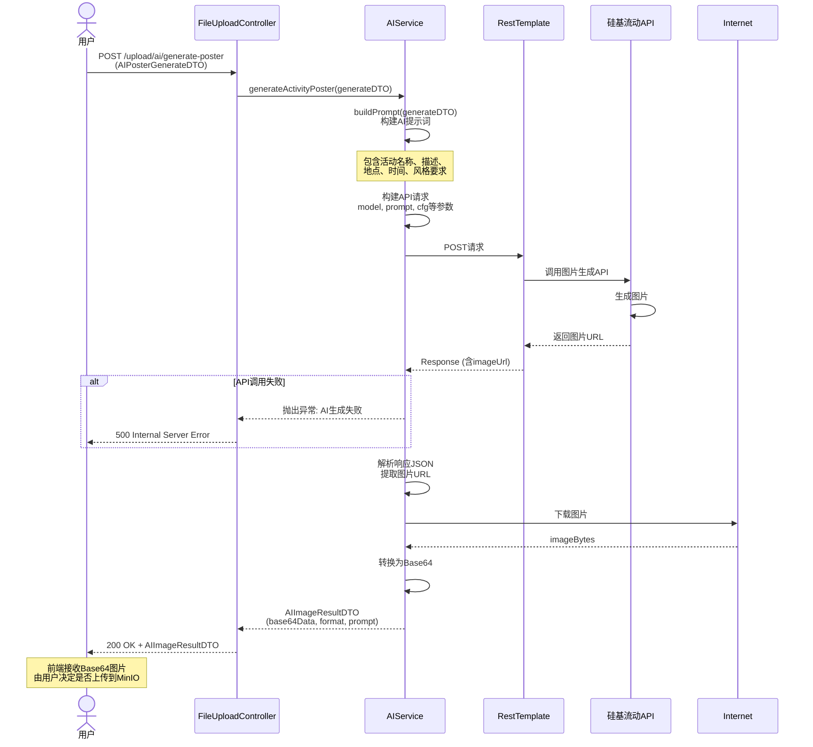
```mermaid
sequenceDiagram
    actor 用户
    participant Controller as FileUploadController
    participant Service as AIService
    participant RestTemplate
    participant API as 硅基流动API
    participant Internet
    
    用户->>Controller: POST /upload/ai/generate-poster<br/>(AIPosterGenerateDTO)
    Controller->>Service: generateActivityPoster(generateDTO)
    
    Service->>Service: buildPrompt(generateDTO)<br/>构建AI提示词
    Note over Service: 包含活动名称、描述、<br/>地点、时间、风格要求
    
    Service->>Service: 构建API请求<br/>model, prompt, cfg等参数
    Service->>RestTemplate: POST请求
    RestTemplate->>API: 调用图片生成API
    
    API->>API: 生成图片
    API-->>RestTemplate: 返回图片URL
    RestTemplate-->>Service: Response (含imageUrl)
    
    alt API调用失败
        Service-->>Controller: 抛出异常: AI生成失败
        Controller-->>用户: 500 Internal Server Error
    end
    
    Service->>Service: 解析响应JSON<br/>提取图片URL
    
    Service->>Internet: 下载图片
    Internet-->>Service: imageBytes
    
    Service->>Service: 转换为Base64<br/>
    
    Service-->>Controller: AIImageResultDTO<br/>(base64Data, format, prompt)
    Controller-->>用户: 200 OK + AIImageResultDTO
    
    Note over 用户: 前端接收Base64图片<br/>由用户决定是否上传到MinIO
```

**说明**：
- 使用硅基流动的文生图API
- Prompt自动包含活动信息和设计要求
- 返回Base64编码的图片，由前端决定是否上传
- 根据不同模型(Qwen/Kolors/FLUX)使用不同参数

### 6.2 AI生成流程活动图

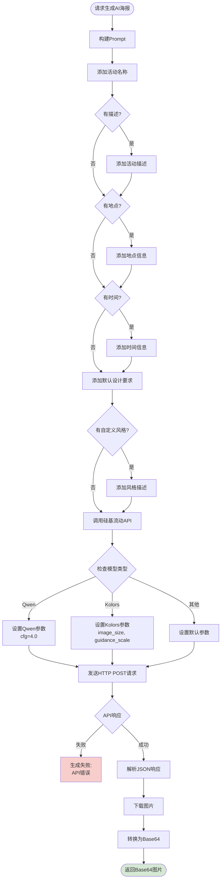
```mermaid
flowchart TD
    Start([请求生成AI海报]) --> BuildPrompt[构建Prompt]
    BuildPrompt --> AddName[添加活动名称]
    AddName --> CheckDesc{有描述?}
    
    CheckDesc -->|是| AddDesc[添加活动描述]
    CheckDesc -->|否| CheckLoc
    AddDesc --> CheckLoc{有地点?}
    
    CheckLoc -->|是| AddLoc[添加地点信息]
    CheckLoc -->|否| CheckTime
    AddLoc --> CheckTime{有时间?}
    
    CheckTime -->|是| AddTime[添加时间信息]
    CheckTime -->|否| AddDefault
    AddTime --> AddDefault[添加默认设计要求]
    
    AddDefault --> CheckStyle{有自定义风格?}
    CheckStyle -->|是| AddStyle[添加风格描述]
    CheckStyle -->|否| CallAPI
    AddStyle --> CallAPI[调用硅基流动API]
    
    CallAPI --> CheckModel{检查模型类型}
    CheckModel -->|Qwen| SetQwenParams[设置Qwen参数<br/>cfg=4.0]
    CheckModel -->|Kolors| SetKolorsParams[设置Kolors参数<br/>image_size, guidance_scale]
    CheckModel -->|其他| SetDefaultParams[设置默认参数]
    
    SetQwenParams --> SendRequest[发送HTTP POST请求]
    SetKolorsParams --> SendRequest
    SetDefaultParams --> SendRequest
    
    SendRequest --> CheckResponse{API响应}
    CheckResponse -->|失败| Fail[生成失败:<br/>API错误]
    CheckResponse -->|成功| ParseJSON[解析JSON响应]
    
    ParseJSON --> DownloadImage[下载图片]
    DownloadImage --> ConvertBase64[转换为Base64]
    ConvertBase64 --> Success([返回Base64图片])
    
    style Success fill:#d5e8d4
    style Fail fill:#f8cecc
```

---

## 七、缓存管理流程

### 7.1 缓存读取策略 (Cache-Aside Pattern)

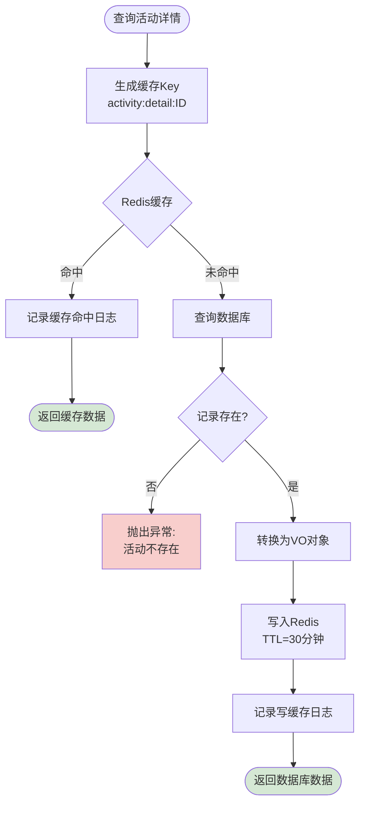
```mermaid
flowchart TD
    Start([查询活动详情]) --> GenKey[生成缓存Key<br/>activity:detail:ID]
    GenKey --> CheckCache{Redis缓存}
    
    CheckCache -->|命中| LogHit[记录缓存命中日志]
    LogHit --> ReturnCache([返回缓存数据])
    
    CheckCache -->|未命中| QueryDB[查询数据库]
    QueryDB --> CheckExists{记录存在?}
    
    CheckExists -->|否| Error[抛出异常:<br/>活动不存在]
    CheckExists -->|是| ConvertVO[转换为VO对象]
    
    ConvertVO --> WriteCache[写入Redis<br/>TTL=30分钟]
    WriteCache --> LogWrite[记录写缓存日志]
    LogWrite --> ReturnDB([返回数据库数据])
    
    style ReturnCache fill:#d5e8d4
    style ReturnDB fill:#d5e8d4
    style Error fill:#f8cecc
```

### 7.2 缓存更新策略

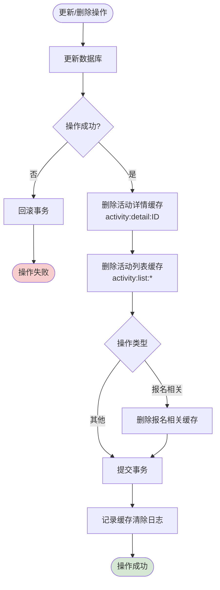
```mermaid
flowchart TD
    Start([更新/删除操作]) --> UpdateDB[更新数据库]
    UpdateDB --> CheckSuccess{操作成功?}
    
    CheckSuccess -->|否| Rollback[回滚事务]
    Rollback --> End1([操作失败])
    
    CheckSuccess -->|是| DeleteDetail[删除活动详情缓存<br/>activity:detail:ID]
    DeleteDetail --> DeleteList[删除活动列表缓存<br/>activity:list:*]
    
    DeleteList --> CheckType{操作类型}
    CheckType -->|报名相关| DeleteReg[删除报名相关缓存]
    CheckType -->|其他| Commit
    
    DeleteReg --> Commit[提交事务]
    Commit --> LogCache[记录缓存清除日志]
    LogCache --> End2([操作成功])
    
    style End2 fill:#d5e8d4
    style End1 fill:#f8cecc
```

**说明**：
- 查询：先查缓存，未命中再查数据库并写缓存
- 更新/删除：先操作数据库，成功后删除缓存
- TTL设置：详情30分钟，列表10分钟
- 使用前缀匹配批量删除列表缓存

### 7.3 惰性更新机制

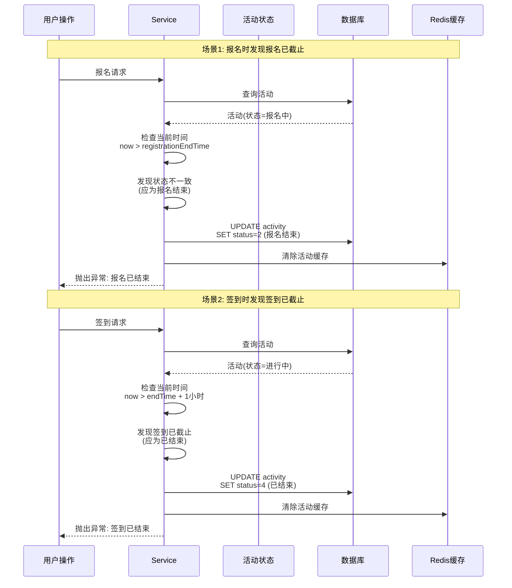
```mermaid
sequenceDiagram
    participant User as 用户操作
    participant Service
    participant Activity as 活动状态
    participant DB as 数据库
    participant Cache as Redis缓存
    
    Note over User,Cache: 场景1: 报名时发现报名已截止
    
    User->>Service: 报名请求
    Service->>DB: 查询活动
    DB-->>Service: 活动(状态=报名中)
    
    Service->>Service: 检查当前时间<br/>now > registrationEndTime
    Service->>Service: 发现状态不一致<br/>(应为报名结束)
    
    Service->>DB: UPDATE activity<br/>SET status=2 (报名结束)
    Service->>Cache: 清除活动缓存
    Service-->>User: 抛出异常: 报名已结束
    
    Note over User,Cache: 场景2: 签到时发现签到已截止
    
    User->>Service: 签到请求
    Service->>DB: 查询活动
    DB-->>Service: 活动(状态=进行中)
    
    Service->>Service: 检查当前时间<br/>now > endTime + 1小时
    Service->>Service: 发现签到已截止<br/>(应为已结束)
    
    Service->>DB: UPDATE activity<br/>SET status=4 (已结束)
    Service->>Cache: 清除活动缓存
    Service-->>User: 抛出异常: 签到已结束
```

**说明**：
- 惰性更新：在用户操作时检测并更新过期状态
- 触发场景：报名、签到等时间敏感操作
- 优点：减少定时任务，状态更新及时准确

---

## 八、权限验证流程

### 8.1 JWT认证拦截器流程图

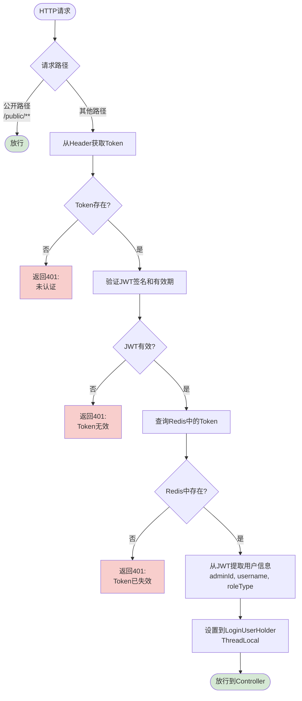
```mermaid
flowchart TD
    Start([HTTP请求]) --> CheckPath{请求路径}
    CheckPath -->|公开路径<br/>/public/**| Allow1([放行])
    CheckPath -->|其他路径| GetToken[从Header获取Token]
    
    GetToken --> CheckToken{Token存在?}
    CheckToken -->|否| Fail1[返回401:<br/>未认证]
    
    CheckToken -->|是| ValidateJWT[验证JWT签名和有效期]
    ValidateJWT --> JWTValid{JWT有效?}
    
    JWTValid -->|否| Fail2[返回401:<br/>Token无效]
    JWTValid -->|是| QueryRedis[查询Redis中的Token]
    
    QueryRedis --> RedisExists{Redis中存在?}
    RedisExists -->|否| Fail3[返回401:<br/>Token已失效]
    
    RedisExists -->|是| ExtractUser[从JWT提取用户信息<br/>adminId, username, roleType]
    ExtractUser --> SetContext[设置到LoginUserHolder<br/>ThreadLocal]
    
    SetContext --> Allow2([放行到Controller])
    
    style Allow1 fill:#d5e8d4
    style Allow2 fill:#d5e8d4
    style Fail1 fill:#f8cecc
    style Fail2 fill:#f8cecc
    style Fail3 fill:#f8cecc
```

### 8.2 操作权限验证流程图

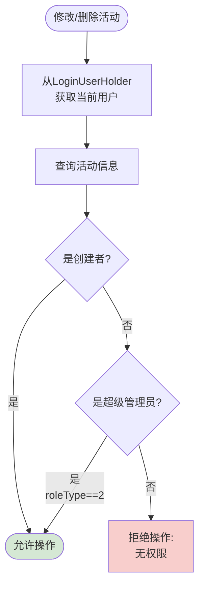
```mermaid
flowchart TD
    Start([修改/删除活动]) --> GetCurrent[从LoginUserHolder<br/>获取当前用户]
    GetCurrent --> GetActivity[查询活动信息]
    GetActivity --> CheckCreator{是创建者?}
    
    CheckCreator -->|是| Allow([允许操作])
    CheckCreator -->|否| CheckRole{是超级管理员?}
    
    CheckRole -->|是<br/>roleType==2| Allow
    CheckRole -->|否| Deny[拒绝操作:<br/>无权限]
    
    style Allow fill:#d5e8d4
    style Deny fill:#f8cecc
```

**说明**：
- 创建者可以修改/删除自己创建的活动
- 超级管理员(roleType=2)可以修改/删除所有活动
- 普通管理员(roleType=1)只能操作自己创建的活动

---

## 九、业务约束和规则

### 9.1 时间约束关系图

```mermaid
graph LR
    A[报名开始时间] -->|必须早于| B[报名结束时间]
    B -->|必须早于或等于| C[活动开始时间]
    C -->|必须早于| D[活动结束时间]
    
    E[签到开始时间] -->|活动开始前30分钟| C
    F[签到结束时间] -->|活动结束后1小时| D
    
    G[发布时间] -->|报名开始时间<br/>必须在当前时间之后| A
    
    style A fill:#e1f5ff
    style B fill:#e1f5ff
    style C fill:#ffe1e1
    style D fill:#ffe1e1
    style E fill:#e1ffe1
    style F fill:#e1ffe1
```

### 9.2 状态转换约束矩阵

| 当前状态    | 可转换状态             | 转换条件             | 是否可删除 | 时间修改限制       |
| ----------- | ---------------------- | -------------------- | ---------- | ------------------ |
| 未发布(0)   | 报名中(1), 已取消(5)   | 发布需通过完整性检查 | 是         | 无限制             |
| 报名中(1)   | 报名结束(2), 已取消(5) | 无                   | 否         | 报名开始时间不可改 |
| 报名结束(2) | 进行中(3), 已取消(5)   | 无                   | 否         | 报名时间不可改     |
| 进行中(3)   | 已结束(4), 已取消(5)   | 无                   | 否         | 活动开始时间不可改 |
| 已结束(4)   | 无                     | -                    | 是         | 所有时间不可改     |
| 已取消(5)   | 无                     | -                    | 是         | 状态不可再改       |

---

