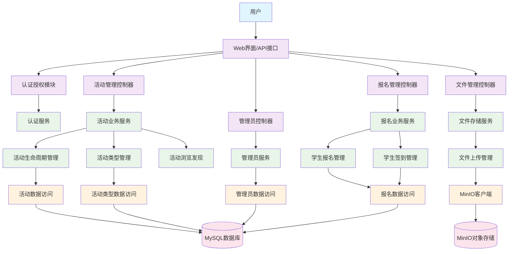
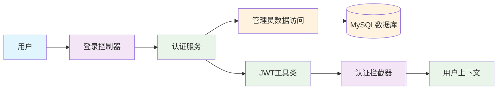
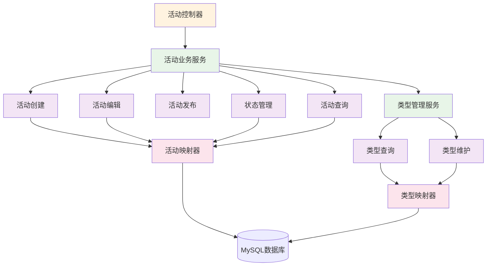
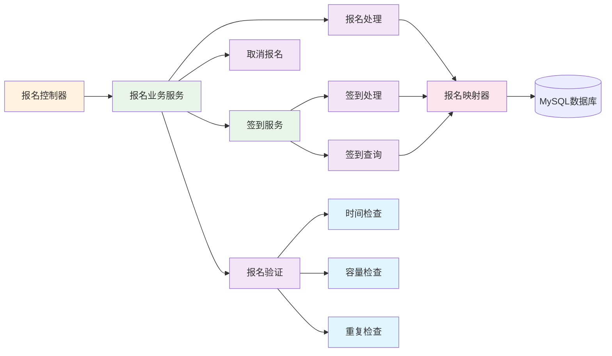
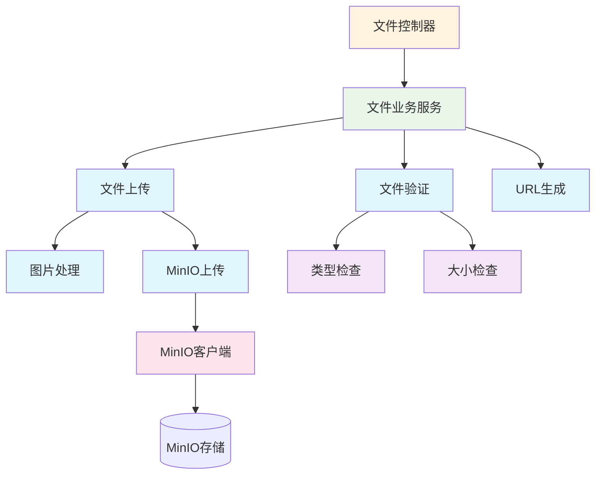
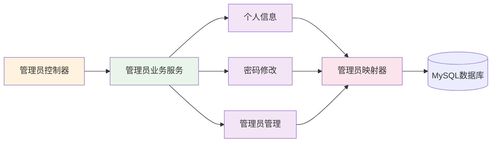
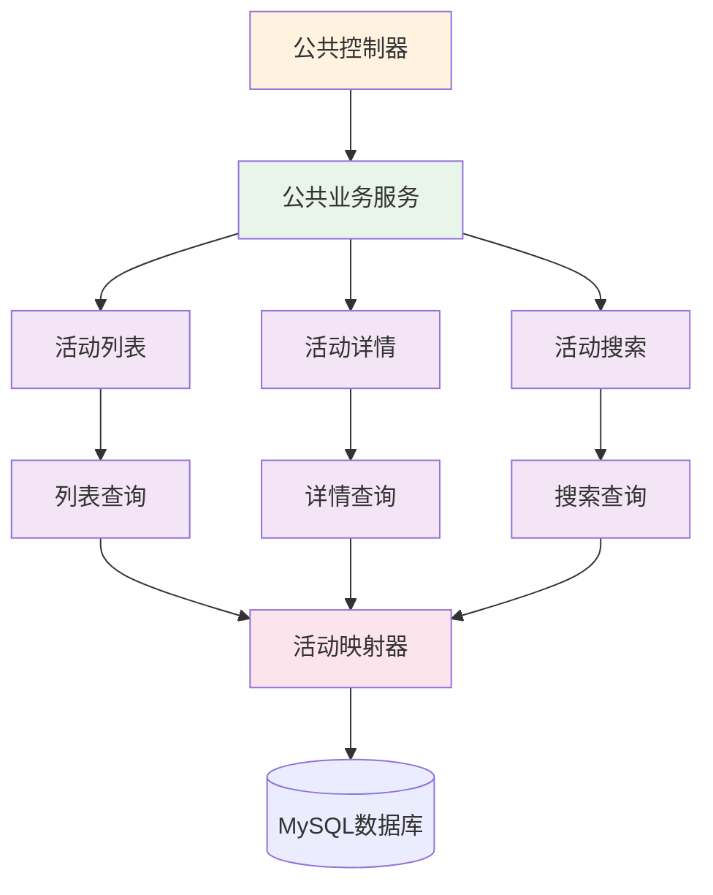

# 高校学生活动全流程管理系统 - 功能模块设计

## 系统概述

高校学生活动全流程管理系统是一个基于Spring Boot的演示项目，为大学校园活动提供基本的生命周期管理。系统支持活动创建、发布、报名、签到等核心功能，服务于活动管理员和参与学生两大用户群体。

## 系统模块架构图



## 1. 用户认证与权限管理



**功能说明：**

- **用户登录**：管理员通过用户名密码登录系统
- **JWT令牌**：生成和验证JWT访问令牌
- **权限控制**：基于角色的访问控制
- **用户上下文**：存储当前登录用户信息

## 2. 活动管理核心模块



**功能说明：**

### 活动生命周期管理
- **活动创建**：创建新活动，填写基本信息、时间、地点等
- **活动编辑**：修改活动信息（在报名开始前）
- **活动发布**：将活动状态改为"报名中"
- **状态管理**：管理活动6种状态的流转
  - 0-未发布 → 1-报名中 → 2-报名结束 → 3-进行中 → 4-已结束
  - 支持取消活动（状态=5）

### 活动类型管理
- **预定义类型**：学术讲座、文体活动、志愿服务、社团活动、竞赛活动、其他
- **类型查询**：获取所有可用活动类型
- **动态管理**：支持新增、修改、删除活动类型

## 3. 学生报名与签到模块



**功能说明：**

### 学生报名管理
- **报名处理**：学生使用手机号和姓名报名
- **报名验证**：
  - 时间窗口检查（在报名时间内）
  - 容量检查（不超过最大参与人数）
  - 重复检查（同一手机号不能重复报名）
- **取消报名**：学生可以取消已报名的活动

### 学生签到管理
- **签到处理**：活动进行中为学生签到
- **签到查询**：查看活动签到情况
- **签到统计**：统计出勤率和签到人数

## 4. 文件管理模块



**功能说明：**
- **文件上传**：上传活动海报等图片文件
- **文件验证**：检查文件类型和大小
  - 支持格式：JPG、PNG
  - 最大大小：50MB
- **图片处理**：基本的图片处理和压缩
- **MinIO集成**：使用MinIO存储文件
- **URL生成**：生成文件访问链接

## 5. 管理员功能模块



- - **功能说明：**
    - **个人信息管理**：查看和修改个人基本信息
    - **密码修改**：修改登录密码
    - **管理员管理**：超级管理员可以管理其他管理员账户

## 6. 公共浏览模块



**功能说明：**
- **活动列表**：分页查看所有已发布的活动
- **活动详情**：查看活动的详细信息
- **活动搜索**：按名称、类型等条件搜索活动

## 核心业务流程

### 活动创建到发布的完整流程
1. **管理员登录** → 获取JWT令牌
2. **创建活动** → 填写活动信息（状态=未发布）
3. **上传海报** → 上传活动宣传图片
4. **发布活动** → 将状态改为"报名中"
5. **学生报名** → 学生在报名时间内报名
6. **活动进行** → 状态自动转为"进行中"
7. **学生签到** → 活动期间为学生签到
8. **活动结束** → 状态自动转为"已结束"

### 数据库核心表设计

```sql
-- 活动表
CREATE TABLE activities (
  id bigint PRIMARY KEY AUTO_INCREMENT,
  activity_name varchar(100) NOT NULL COMMENT '活动名称',
  activity_status tinyint DEFAULT 0 COMMENT '状态:0未发布,1报名中,2报名结束,3进行中,4已结束,5已取消',
  start_time datetime NOT NULL COMMENT '活动开始时间',
  end_time datetime NOT NULL COMMENT '活动结束时间',
  max_participants int COMMENT '最大参与人数',
  creator_id bigint NOT NULL COMMENT '创建者ID',
  create_time datetime DEFAULT CURRENT_TIMESTAMP
);

-- 报名表
CREATE TABLE registrations (
  id bigint PRIMARY KEY AUTO_INCREMENT,
  activity_id bigint NOT NULL COMMENT '活动ID',
  student_name varchar(50) NOT NULL COMMENT '学生姓名',
  student_phone varchar(20) NOT NULL COMMENT '学生手机号',
  registration_status tinyint DEFAULT 1 COMMENT '状态:1报名成功,2已取消',
  check_in_status tinyint DEFAULT 0 COMMENT '签到状态:0未签到,1已签到',
  check_in_time datetime COMMENT '签到时间',
  create_time datetime DEFAULT CURRENT_TIMESTAMP,
  UNIQUE KEY uk_activity_phone (activity_id, student_phone)
);
```

## 技术实现要点

### 1. 状态管理
- 使用状态机模式管理活动状态转换
- 在Service层进行状态验证和转换
- 确保状态转换的业务合理性

### 2. 数据验证
- Controller层：基础参数验证
- Service层：业务规则验证
- 数据层：数据完整性约束

### 3. 异常处理
- 统一异常响应格式
- 业务异常和系统异常分类处理
- 友好的错误信息提示

### 4. 分页查询
- 使用PageHelper实现分页
- 统一分页参数和响应格式
- 支持排序和筛选

## 开发优先级

### 第一阶段（核心功能）
1. 用户认证登录
2. 活动创建和发布
3. 活动列表和详情查看
4. 学生报名功能

### 第二阶段（完善功能）
1. 活动编辑和取消
2. 学生签到功能
3. 文件上传（活动海报）
4. 管理员管理

### 第三阶段（优化功能）
1. 活动搜索
2. 报名统计
3. 数据导出
4. 界面美化

这个简化的模块设计专注于核心业务功能，移除了复杂的运维和生产环境相关内容，更适合作为演示项目进行开发和部署。