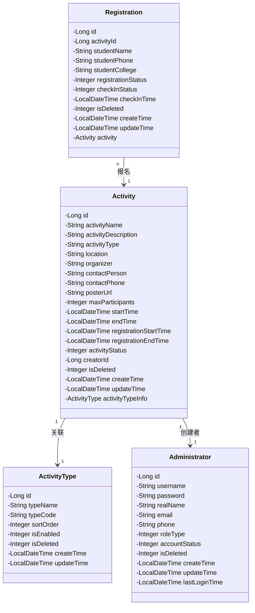
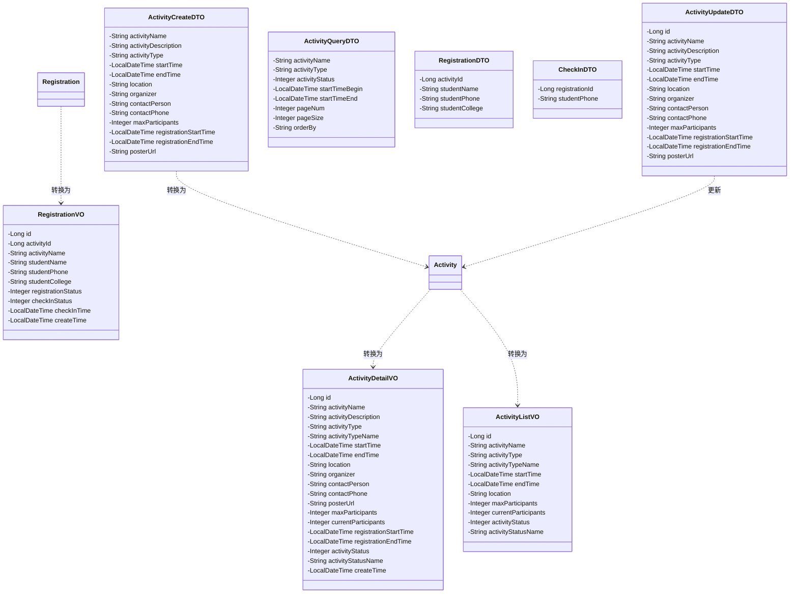

## 核心实体类图

## 分层架构类图

```mermaid
classDiagram
    %% Controller层
    class ActivityController {
        -ActivityService activityService
        +createActivity(ActivityCreateDTO) Result~ActivityDetailVO~
        +updateActivity(ActivityUpdateDTO) Result~ActivityDetailVO~
        +deleteActivity(Long) Result~Void~
        +updateActivityStatus(ActivityStatusUpdateDTO) Result~ActivityDetailVO~
        +publishActivity(Long) Result~ActivityDetailVO~
        +cancelActivity(Long) Result~ActivityDetailVO~
        +getActivityList(ActivityQueryDTO) Result~PageInfo~
        +getActivityDetail(Long) Result~ActivityDetailVO~
    }

    class PublicController {
        -ActivityService activityService
        -ActivityTypeService activityTypeService
        +getPublicActivityList(ActivityQueryDTO) Result~PageInfo~
        +getPublicActivityDetail(Long) Result~ActivityDetailVO~
        +getActivityTypes() Result~List~
    }

    class RegistrationController {
        -RegistrationService registrationService
        +register(RegistrationDTO) Result~RegistrationVO~
        +cancelRegistration(Long) Result~Void~
        +checkIn(CheckInDTO) Result~RegistrationVO~
        +getRegistrationList(RegistrationQueryDTO) Result~PageInfo~
    }

    class AdminController {
        -AuthService authService
        +login(AdminLoginDTO) Result~AdminVO~
        +logout() Result~Void~
        +getCurrentAdmin() Result~AdminVO~
    }

    class FileUploadController {
        -FileUploadService fileUploadService
        -AIService aiService
        +uploadFile(MultipartFile) Result~FileUploadResultDTO~
        +deleteFile(String) Result~Void~
        +generateAIPoster(AIPosterGenerateDTO) Result~AIImageResultDTO~
    }

    %% Service层
    class ActivityService {
        <<interface>>
        +createActivity(ActivityCreateDTO) ActivityDetailVO
        +updateActivity(ActivityUpdateDTO) ActivityDetailVO
        +deleteActivity(Long) void
        +updateActivityStatus(ActivityStatusUpdateDTO) ActivityDetailVO
        +getActivityList(ActivityQueryDTO) PageInfo
        +getActivityDetail(Long) ActivityDetailVO
        +publishActivity(Long) ActivityDetailVO
        +cancelActivity(Long) ActivityDetailVO
        +incrementViewCount(Long) void
    }

    class ActivityServiceImpl {
        -ActivityMapper activityMapper
        -ActivityTypeMapper activityTypeMapper
        -AdministratorMapper administratorMapper
        -RedisService redisService
        -MinioUtil minioUtil
        +createActivity(ActivityCreateDTO) ActivityDetailVO
        +updateActivity(ActivityUpdateDTO) ActivityDetailVO
        +deleteActivity(Long) void
        +updateActivityStatus(ActivityStatusUpdateDTO) ActivityDetailVO
        +getActivityList(ActivityQueryDTO) PageInfo
        +getActivityDetail(Long) ActivityDetailVO
        +publishActivity(Long) ActivityDetailVO
        +cancelActivity(Long) ActivityDetailVO
        +incrementViewCount(Long) void
    }

    class RegistrationService {
        <<interface>>
        +register(RegistrationDTO) RegistrationVO
        +cancelRegistration(Long) void
        +checkIn(CheckInDTO) RegistrationVO
        +getRegistrationList(RegistrationQueryDTO) PageInfo
    }

    class AuthService {
        <<interface>>
        +login(AdminLoginDTO) AdminVO
        +logout() void
        +getCurrentAdmin() AdminVO
    }

    class FileUploadService {
        <<interface>>
        +uploadFile(MultipartFile) FileUploadResultDTO
        +deleteFile(String) void
    }

    class AIService {
        <<interface>>
        +generateActivityPoster(AIPosterGenerateDTO) AIImageResultDTO
    }

    class RedisService {
        +set(String, Object, Long) void
        +get(String) Object
        +delete(String) void
        +exists(String) Boolean
    }

    %% Mapper层
    class ActivityMapper {
        <<interface>>
        +insert(Activity) int
        +update(Activity) int
        +deleteById(Long) int
        +selectById(Long) Activity
        +selectList(ActivityQueryDTO) List~Activity~
    }

    class RegistrationMapper {
        <<interface>>
        +insert(Registration) int
        +update(Registration) int
        +deleteById(Long) int
        +selectById(Long) Registration
        +selectList(RegistrationQueryDTO) List~Registration~
    }

    class AdministratorMapper {
        <<interface>>
        +insert(Administrator) int
        +update(Administrator) int
        +selectById(Long) Administrator
        +selectByUsername(String) Administrator
    }

    class ActivityTypeMapper {
        <<interface>>
        +insert(ActivityType) int
        +update(ActivityType) int
        +selectById(Long) ActivityType
        +selectByCode(String) ActivityType
        +selectAll() List~ActivityType~
    }

    %% 关系
    ActivityController --> ActivityService : 依赖
    PublicController --> ActivityService : 依赖
    PublicController --> ActivityTypeService : 依赖
    RegistrationController --> RegistrationService : 依赖
    AdminController --> AuthService : 依赖
    FileUploadController --> FileUploadService : 依赖
    FileUploadController --> AIService : 依赖

    ActivityServiceImpl ..|> ActivityService : 实现
    ActivityServiceImpl --> ActivityMapper : 依赖
    ActivityServiceImpl --> ActivityTypeMapper : 依赖
    ActivityServiceImpl --> AdministratorMapper : 依赖
    ActivityServiceImpl --> RedisService : 依赖

    ActivityMapper --> Activity : 操作
    RegistrationMapper --> Registration : 操作
    AdministratorMapper --> Administrator : 操作
    ActivityTypeMapper --> ActivityType : 操作
```

## DTO与VO类图

## 类关系说明

### 1. 实体关系（Entity）

#### Activity（活动）与 ActivityType（活动类型）
- **关系类型**：一对一关联（单向）
- **说明**：每个活动都有一个活动类型，通过`activityType`字段（存储类型编码）关联到`ActivityType`表的`typeCode`字段。在查询活动详情时，会关联查询活动类型信息，存储在`activityTypeInfo`字段中。

#### Activity（活动）与 Administrator（管理员）
- **关系类型**：多对一关联
- **说明**：每个活动由一个管理员创建，通过`creatorId`字段关联到`Administrator`表的`id`字段。一个管理员可以创建多个活动。

#### Registration（报名记录）与 Activity（活动）
- **关系类型**：多对一关联（双向）
- **说明**：多个学生可以报名同一个活动。`Registration`通过`activityId`字段关联到`Activity`表的`id`字段。在查询报名记录详情时，会关联查询活动信息，存储在`activity`字段中。

### 2. 分层架构关系

#### Controller → Service
- **关系类型**：依赖关系（Dependency）
- **说明**：Controller层通过`@Autowired`注入Service接口，调用Service层的业务方法。Controller只依赖Service接口，不依赖具体实现，符合依赖倒置原则。

#### Service → ServiceImpl
- **关系类型**：实现关系（Realization）
- **说明**：ServiceImpl实现Service接口，提供具体的业务逻辑实现。

#### ServiceImpl → Mapper
- **关系类型**：依赖关系（Dependency）
- **说明**：ServiceImpl通过`@Autowired`注入Mapper接口，调用Mapper层的数据访问方法。

#### ServiceImpl → RedisService
- **关系类型**：依赖关系（Dependency）
- **说明**：ServiceImpl使用RedisService进行缓存管理，实现查询优化和数据一致性。

#### Mapper → Entity
- **关系类型**：操作关系（Uses）
- **说明**：Mapper接口定义了对Entity的CRUD操作，通过MyBatis映射到SQL语句。

### 3. DTO与Entity的关系

#### DTO → Entity（转换）
- **关系类型**：依赖关系（Dependency）
- **说明**：
  - `ActivityCreateDTO`：用于创建活动，转换为`Activity`实体后插入数据库
  - `ActivityUpdateDTO`：用于更新活动，将DTO中的非空字段更新到`Activity`实体
  - `RegistrationDTO`：用于创建报名记录，转换为`Registration`实体

#### Entity → VO（转换）
- **关系类型**：依赖关系（Dependency）
- **说明**：
  - `Activity` → `ActivityDetailVO`：活动详情视图，包含完整的活动信息和扩展字段
  - `Activity` → `ActivityListVO`：活动列表视图，包含列表展示所需的关键信息
  - `Registration` → `RegistrationVO`：报名记录视图，包含报名信息和关联的活动名称

### 4. 特殊组件说明

#### RedisService（缓存服务）
- **作用**：提供Redis缓存的基本操作，包括设置、获取、删除缓存
- **使用场景**：
  - 缓存活动详情，减少数据库查询
  - 缓存活动列表，提高查询性能
  - 在更新、删除操作时清除相关缓存，保证数据一致性

#### MinioUtil（文件存储工具）
- **作用**：提供MinIO对象存储的操作，包括上传、删除文件
- **使用场景**：
  - 上传活动海报图片
  - 删除活动时同步删除相关海报文件

#### AIService（AI服务）
- **作用**：调用外部AI API生成活动海报
- **使用场景**：根据活动信息自动生成海报图片
