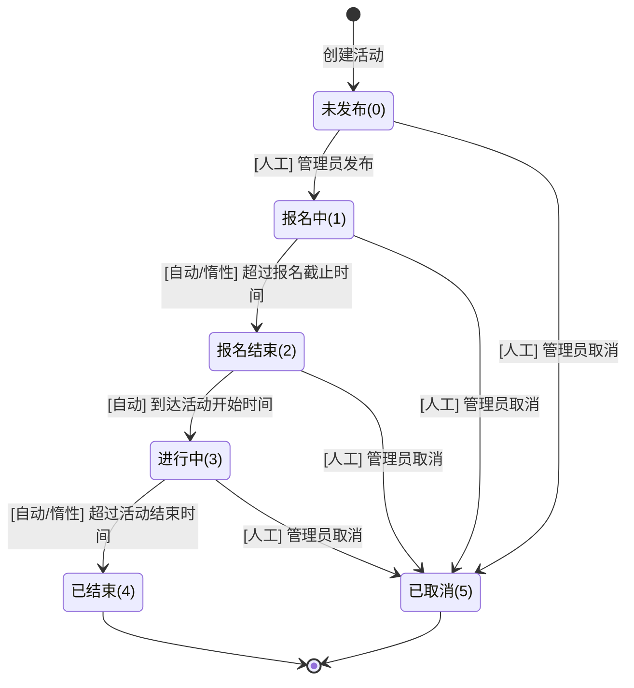

# 活动状态转移说明文档

本文档基于系统代码逻辑（截至 2025-11-27），详细说明活动全生命周期的状态流转规则、触发机制及操作限制。

## 1. 状态定义 (ActivityStatusEnum)

| 状态码 | 状态名称                          | 说明                                       |
| :----- | :-------------------------------- | :----------------------------------------- |
| **0**  | **未发布** (UNRELEASED)           | 活动创建后的初始状态，仅管理员可见。       |
| **1**  | **报名中** (REGISTERING)          | 活动已发布，学生可以报名。                 |
| **2**  | **报名结束** (REGISTRATION_ENDED) | 报名截止时间已过，不可报名，等待活动开始。 |
| **3**  | **进行中** (IN_PROGRESS)          | 活动开始时间已到，正在进行中。             |
| **4**  | **已结束** (ENDED)                | 活动结束时间已过。                         |
| **5**  | **已取消** (CANCELLED)            | 活动被管理员手动取消。                     |

## 2. 状态流转图

## 3. 流转机制详解

### 3.1 人工流转 (管理员操作)

| 源状态              | 目标状态   | 操作接口                 | 说明                           |
| :------------------ | :--------- | :----------------------- | :----------------------------- |
| **未发布**          | **报名中** | `/activity/publish/{id}` | 活动发布，正式对外开放。       |
| **任意** (除已结束) | **已取消** | `/activity/cancel/{id}`  | 紧急停止活动，状态变为已取消。 |

### 3.2 自动流转 (定时任务)

系统通过 `ActivityStatusTask` 每分钟执行一次，根据时间自动推进状态：

1.  **报名中(1) → 报名结束(2)**
    *   **条件**: `当前时间 > 报名截止时间`
2.  **报名结束(2) → 进行中(3)**
    *   **条件**: `当前时间 >= 活动开始时间`
3.  **进行中(3) → 已结束(4)**
    *   **条件**: `当前时间 > 活动结束时间`

### 3.3 惰性流转 (业务触发双重保险)

为防止定时任务延迟导致的数据不一致，在关键业务接口中植入了惰性更新逻辑：

1.  **报名时触发 (RegistrationServiceImpl)**
    *   如果学生尝试报名，但 `当前时间 > 报名截止时间` 且状态仍为 `报名中`：
    *   **动作**: 立即将状态更新为 **报名结束(2)**，清理缓存，并拒绝报名。
2.  **签到时触发 (RegistrationServiceImpl)**
    *   如果学生尝试签到，但 `当前时间 > 签到截止时间(活动结束+1h)` 且状态未结束：
    *   **动作**: 立即将状态更新为 **已结束(4)**，清理缓存，并拒绝签到。

## 4. 操作限制说明

### 4.1 修改限制 (Update)
为了保证数据一致性，对 `updateActivity` 接口实施了严格限制：
*   **未发布(0)**: **允许修改**所有信息（包括时间），即使当前时间已过报名开始时间（用于修正错误）。
*   **已发布(1/2/3)**: **禁止修改**任何信息。一旦活动开始报名，所有信息锁定。
*   **已结束/已取消(4/5)**: 禁止修改。

### 4.2 删除限制 (Delete)
为了保护活动数据，对 `deleteActivity` 接口实施了状态限制：
*   **允许删除**: 未发布(0)、已结束(4)、已取消(5)。
*   **禁止删除**: 报名中(1)、报名结束(2)、进行中(3)。
