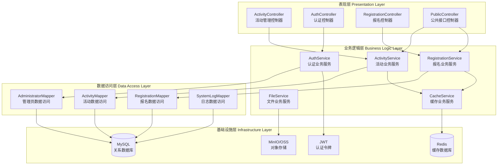
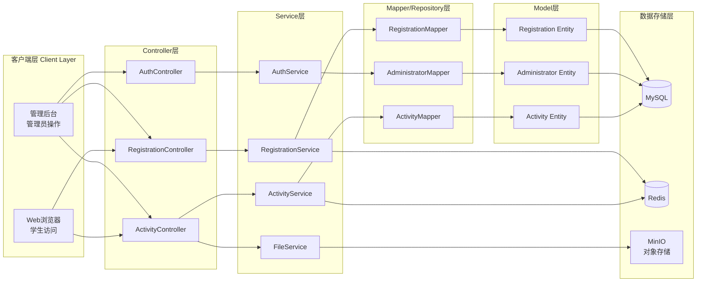
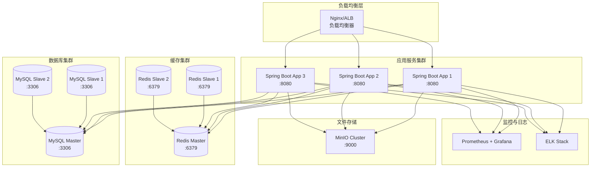
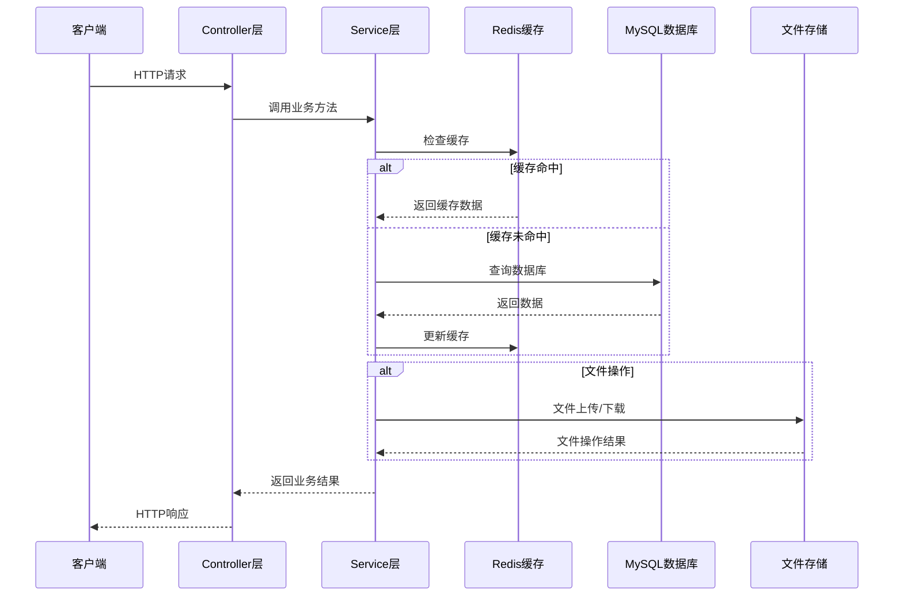

# 系统概要设计

## 一、开发环境设计

### 1.1 基础软件环境
- **操作系统**: Windows 10/11, Linux (Ubuntu 20.04+), macOS 10.15+
- **JDK**: OpenJDK 17 或 Oracle JDK 17 (LTS版本)
- **Maven**: 3.6.0+ (推荐3.8.x版本)
- **IDE**: IntelliJ IDEA 2023.2+, Eclipse 2023-06+, VS Code
- **Git**: 2.25.0+ (版本控制)

### 1.2 数据库环境
- **MySQL**: 8.0.33+ (主数据库)
  - 字符集: utf8mb4
  - 排序规则: utf8mb4_unicode_ci
  - 存储引擎: InnoDB
  - 连接池: HikariCP (Spring Boot默认)
- **Redis**: 6.0.16+ (缓存数据库)
  - 内存要求: 最小512MB
  - 持久化: RDB + AOF
  - 最大内存策略: allkeys-lru
- **MinIO**: 8.5.13+ (对象存储服务)
  - 用途: 活动海报、图片文件存储
  - 存储要求: 最小10GB可用空间
  - 访问协议: HTTP/HTTPS
  - 分片策略: 标准桶(Bucket)存储

### 1.3 完整技术栈

#### 1.3.1 核心框架
- **Spring Boot**: 3.4.11（应用框架）
- **Spring Web**: 6.2.0（REST API）
- **Spring Data Redis**: 3.4.11（缓存）

#### 1.3.2 数据访问层
- **MyBatis**: 3.0.5（ORM框架）
- **MySQL Connector**: 8.2.0（数据库驱动）
- **MyBatis Spring Boot Starter**: 3.0.5（集成）

#### 1.3.3 认证与安全
- **JWT处理**: io.jsonwebtoken:jjwt-api:0.12.6
- **JWT实现**: io.jsonwebtoken:jjwt-impl:0.12.6  
- **JWT扩展**: io.jsonwebtoken:jjwt-jackson:0.12.6

#### 1.3.4 文件存储
- **MinIO客户端**: io.minio:minio:8.5.13

#### 1.3.5 API文档与工具
- **Lombok**: 1.18.34（代码简化）
- **Jackson**: com.fasterxml.jackson.core:jackson-databind (JSON处理)
- **Knife4J**: com.github.xiaoymin（生成接口文档）
- **pagehelper**: com.github.pagehelper（分页查询）


### 1.4 开发环境配置要求

#### 1.4.1 环境变量配置
```bash

# 数据库连接配置
DB_HOST=47.122.51.163
DB_PORT=3306
DB_NAME=activities_dev
DB_USERNAME=root
DB_PASSWORD=ECS_mysql_password

# Redis连接配置  
REDIS_HOST=47.122.51.163
REDIS_PORT=6379
无密码

# JWT配置
JWT_SECRET=your_256_bit_secret_key_here
JWT_EXPIRATION=86400000  # 24小时

# 文件存储配置
FILE_STORAGE_TYPE=minio  # minio/oss/s3
MINIO_ENDPOINT=http://47.122.51.163:9000
MINIO_ACCESS_KEY=minioadmin
MINIO_SECRET_KEY=minioadmin
MINIO_BUCKET=activities
```


## 二、技术架构设计

### 2.1 分层架构模式

#### 2.1.1 整体架构图



#### 2.1.2 MVC架构图



#### 2.1.3 系统部署架构图



#### 2.1.4 数据流架构图



